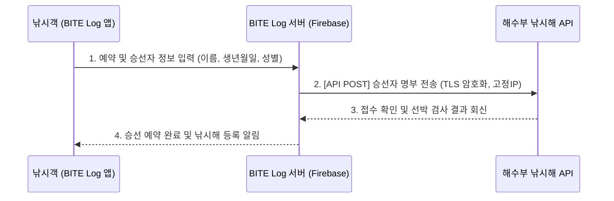

# 낚시해(海) 전자승선명부 Open API 연동 제안서 (BITE Log)

## 1. 서비스 개요
- **서비스명**: BITE Log (바다낚시 조과 기록 및 승선 예약 플랫폼)
- **개발사/담당자**: [대표님 성함 / 회사명]
- **서비스 형태**: 모바일 웹앱 (PWA, Next.js 기반)
- **목적**: 낚시 예약 시 승선자 정보를 자동으로 낚시해 시스템에 보고하여 해양 안전과 승선 편의성 제고.

## 2. 연동 아키텍처 및 데이터 흐름

## 3. 필요 연동 정보 (요청 사항)
저희 시스템에서 API 연동을 위해 다음 정보와 권한을 요청합니다:
1. **API 스펙 문서**: 개발자용 가이드 (엔드포인트, 송수신 JSON 스키마, 에러 코드)
2. **테스트 환경**: 개발계정(샌드박스) API Key 및 접속 권한
3. **운영 환경 권한**: 실서버(고정 IP) 등록 및 운영 API Key 발급 절차 안내

## 4. 보안 및 개인정보 보호 조치 (완료·예정)
- **HTTPS 통신**: 전 구간 TLS 1.3 암호화 통신 적용
- **서버 접근 통제**: 전용 고정 IP를 통해서만 API 호출 (Firebase Functions)
- **개인정보처리방침**: 승선자 정보(생년월일, 성별, 이름 등)를 "출입항신고 목적"으로 해양수산부에 제3자 제공한다는 내용 명시 및 동의 수집.

## 5. 예상 추진 일정
- **1주차**: API 가이드 수령 및 샌드박스 테스트
- **2주차**: BITE Log 시스템 내부 로직 구현 및 데이터 매핑
- **3주차**: 해수부 실서버 연동 심사 요청 및 운영 권한 승인

---

**[담당자 연락망 및 제출처]**
- 해양수산부 수산자원정책과 낚시해 담당 담당자 (044-200-5539) 
- 소통24 협업이음터 제출용 문서.