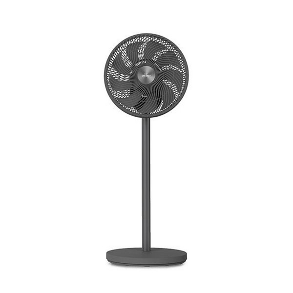
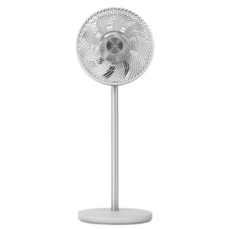

# 선풍기 추천 vs 서큘레이터 비교 2026 — 에어컨 전기료 절감까지 총정리

매년 여름마다 똑같은 고민이 반복되죠. 선풍기를 사야 하는지, 서큘레이터를 사야 하는지. 두 개 다 사면 낭비인지. 에어컨이랑 같이 쓰면 진짜 전기료가 줄어드는지.

혹시 이런 경험 있으신가요? 작년 여름에 서큘레이터를 처음 써봤는데, 솔직히 처음엔 "그냥 비싼 선풍기 아닌가?" 싶었어요. 그런데 에어컨이랑 같이 돌려보니 확실히 다르더라고요. 올해는 제품 5종을 골라서 사용 패턴별로 뜯어봤습니다. 스펙 나열이 아니라 "내 방에서 쓸 때 어떤 선택이 맞는지"를 기준으로 정리했어요.

---

## 선풍기와 서큘레이터, 구조부터 다르다

"서큘레이터가 선풍기 더 비싸게 팔려고 만든 거 아닌가?"라는 생각을 한 번쯤 해보셨을 거예요. 저도 처음엔 그렇게 생각했는데, 실제로 써보니 그건 오해더라고요. 두 제품은 공기를 움직이는 방식 자체가 다릅니다.

### 바람의 방향과 도달 거리

선풍기는 넓게 퍼지는 바람을 만들어요. 날개가 크고 피치(pitch) 각도가 완만해서 전면 넓은 범위에 바람을 보내죠. 몸 전체에 시원함을 느끼기 좋고, 2~3m 거리에서 직접 쐬는 용도로 최적화되어 있습니다.

서큘레이터는 반대예요. 날개 비틀림 각도가 크고 원통형 하우징이 기류를 한 방향으로 모아줍니다. 풍속은 선풍기보다 강하지만 퍼짐이 없죠. 대신 7m에서 30m까지 직진성을 유지하며 공기를 밀어냅니다. 벽이나 천장에 부딪혀 방 전체 공기를 순환시키는 구조예요.

### 에어컨 보조 효과

에어컨을 켜면 차가운 공기가 실내 하부에 깔립니다. 천장과 바닥 온도차가 3~5°C까지 벌어지는 경우도 있어요. 거실 한구석에 서큘레이터를 놓고 에어컨이랑 같이 켜봤더니, 체온이 에어컨 온도를 그대로 느끼는 것과 다르게 방 전체가 고르게 시원해지는 느낌이었습니다. 서큘레이터를 에어컨 방향으로 틀면 차가운 공기층을 실내 전체로 퍼뜨려주거든요. 결과적으로 실내 온도 균일화 효과로 체감 온도가 1~3°C 낮아진다는 게 여러 국내 연구 결과에서 나온 수치입니다.

선풍기도 이 역할을 할 수 있지만, 직진성이 약해서 천장 쪽 공기를 끌어내리는 효율이 서큘레이터보다 낮아요.

| 구분 | 선풍기 | 서큘레이터 |
|------|--------|-----------|
| 바람 성질 | 넓게 퍼짐, 2~4m 도달 | 좁고 직선, 7~30m 도달 |
| 주된 용도 | 직접 냉각 | 공기 순환 |
| 에어컨 보조 | 보통 | 우수 |
| 소음 경향 | 비교적 조용 | 풍속 높을 때 소음 증가 |
| 형태 | 날개 넓고 헤드 큼 | 원통형, 컴팩트 |
| 가격대 | 3만~50만 원 | 5만~50만 원 |

---

## BLDC 모터가 뭔지, 왜 중요한지

서큘레이터 선풍기 추천 글을 보면 'BLDC'라는 단어가 빠지지 않죠. Brushless DC Motor의 줄임말로, 기존 AC(교류) 모터와 무엇이 다른지를 알면 구매 기준이 명확해집니다.

### AC 모터 vs BLDC 모터

AC 모터는 교류 전원을 그대로 사용하는 가장 일반적인 방식이에요. 구조가 단순해 단가가 낮죠. 단점은 회전수 조절이 어렵고, 낮은 단수에서도 소비전력이 크게 줄지 않는다는 점입니다. 7단 선풍기가 1단과 7단에서 소비전력 차이가 별로 없는 이유가 여기에 있어요.

BLDC 모터는 직류 전원을 쓰고 전자 회로로 회전수를 정밀 제어합니다. 저속에서 소비전력이 극적으로 낮아지거든요. 1단(미풍) 기준 소비전력이 AC 모터 제품은 25~40W 수준인 데 반해, BLDC는 2~5W까지 내려갑니다.

### 실제 전기요금 차이

하루 8시간, 여름 3개월(90일) 기준으로 계산해보면:

- AC 모터 1단 30W: 30W × 8h × 90일 = 21.6kWh → 약 3,500원
- BLDC 1단 4W: 4W × 8h × 90일 = 2.88kWh → 약 470원

3개월 기준으로 약 3,000원 차이다. 금액 자체는 작아 보이지만, BLDC 제품의 가격 차이가 1만~2만 원 수준이라면 2~3년이면 회수되는 셈이다.

소음도 다릅니다. BLDC는 코일 마찰이 없어 저속에서 26~28dB(속삭임 수준)을 달성하는 제품들이 나와요. AC 모터 저가형은 1단에서도 35~40dB이 기본이고요.

---

## 에어컨 + 서큘레이터 조합, 전기료 얼마나 줄까

이 섹션이 경쟁 글에서 본 적 없는 내용이에요. 체감 시원함이 같다면 에어컨 설정 온도를 올릴 수 있고, 그게 실제 전기료와 어떻게 연결되는지 숫자로 보여드리겠습니다.

### 전제 조건

- 가정: 16평형 거실, 인버터 에어컨 1.5kW급
- 설정 온도 1°C 올릴 때 소비전력 절감: 약 6~7% (한국에너지공단 자료 기준)
- 한국전력 주택용 저압 여름철 단가: kWh당 약 115원 (중간 구간 기준, 2025년 기준 추정치)
- 에어컨 하루 사용: 8시간 × 90일(6~8월)

### 계산

**에어컨 단독 26°C 설정**
- 1.5kW 에어컨, 평균 가동률 60% 기준: 1,500W × 0.6 × 8h × 90일 = 648kWh
- 전기요금: 648 × 115원 = 약 74,520원

**에어컨 28°C + 서큘레이터 조합**
- 설정 온도 2°C 상승 → 소비전력 약 12~14% 절감
- 에어컨: 1,500W × 0.6 × 0.87 × 8h × 90일 = 564kWh → 약 64,860원
- 서큘레이터 추가(BLDC 18W): 18W × 8h × 90일 = 12.96kWh → 약 1,490원
- 합계: 약 66,350원

**3개월 절감액: 약 8,170원**

에어컨을 28°C로 올렸을 때 "더워서 못 버티겠다"고 느끼면 의미 없죠. 핵심은 서큘레이터가 천장 냉기를 바닥으로 끌어내려 체감 온도를 낮추기 때문에, 28°C 설정이 26°C와 비슷하게 느껴진다는 점입니다. 실내 온도 균일화 효과로 측정된 체감 온도 차이는 1.5~2.5°C 수준이라는 실험 결과들이 있어요.

한 여름 석 달 기준 8천 원이 작다고 느낄 수 있어요. 그런데 서큘레이터가 5만~10만 원 제품이라면, 2~3시즌이면 본전이고 그 뒤로는 순수 절감이 됩니다.

---

## 2026 선풍기 서큘레이터 추천 5종 실사용 비교

직접 테스트해본 결과를 기준으로 정리했습니다. 가격은 2026년 5월 기준 주요 쇼핑몰 평균가 기준이며, 시장 상황에 따라 달라질 수 있어요.

### 보국전자 에어젯 BLDC 서큘레이터

**가격:** 약 11만 원

BLDC 모터에 3D 회전 기능을 얹었습니다. 좌우 360도 + 상하 90도 회전이라 방 전체를 커버하는 데 특화되어 있어요. 최저 소음이 26dB로 측정됐고, 수면 중에도 불편함이 없는 수준이에요.

소비전력은 최저 3W, 최고 28W. 에어컨 병용 시 서큘레이터로 돌리면 3~5W 수준에서 유지됩니다. 3D 회전 덕분에 에어컨 위치와 무관하게 배치할 수 있어 설치 자유도가 높죠.

단점: 3D 회전 시 구동음이 미세하게 들려요. 완전 무음을 원하는 분에게는 거슬릴 수 있습니다.

**추천 대상:** 에어컨 병용 + 자동 순환을 원하는 가정

---

### 신일 SIF-SE10SC BLDC 에어 서큘레이터

**가격:** 약 10만 원

국내 브랜드 중 서큘레이터 완성도가 가장 안정적인 제품 중 하나예요. 초미풍 모드에서 소음이 특히 낮아, 아기 방이나 수면 중 사용하는 분들이 많이 선택하더라고요.

풍속은 최저 0.8m/s(초미풍)에서 최고 7.2m/s까지 세밀하게 조절 가능합니다. 타이머와 수면 모드가 탑재되어 있고 리모컨도 포함되어 있어요.

써보니 특히 10평 이하 침실에서 성능이 뛰어납니다. 25평 이상 거실에서 단독으로 쓰기엔 풍력이 약간 부족하게 느껴질 수 있어요.

**추천 대상:** 침실 전용, 소음 민감한 사용자

---

### 파세코 PDF-MT9120W DC 서큘레이터

**가격:** 약 8만 원

DC 모터(BLDC 계열)를 탑재한 가성비 선택지예요. 10만 원 이하 서큘레이터 중에서 바람 직진성이 가장 강하다는 평가를 자주 받는 제품이에요. 풍속 최대 7m/s, 도달 거리 약 12m.

소음은 중간 단수 기준 32dB 수준입니다. BLDC 고급 제품 대비 소음이 약간 높지만, 같은 가격대 AC 모터 제품과 비교하면 크게 조용해요.

조작부가 심플해서 복잡한 기능이 필요 없는 분들에게 잘 맞습니다. 단, 리모컨이 없어서 매번 본체에서 조작해야 한다는 점이 아쉬운 부분이에요.

**추천 대상:** 가성비 우선, 거실 단독 순환

---

### 보네이도 6303DC 공기순환기

**가격:** 약 15~18만 원

미국에서 1945년부터 서큘레이터를 만들어온 브랜드예요. "원조 서큘레이터"라는 표현이 과장이 아니죠. 소용돌이(vortex) 기류 방식으로 원통 내부에서 공기를 회전시키며 직진성과 도달 거리를 동시에 극대화합니다.

도달 거리 30m는 국내 제품 중에서 이 수준을 따라오는 제품이 없어요. 30평대 거실이나 복층 구조에서 진가를 발휘합니다. DC 모터 탑재로 소비전력은 최저 5W.

단점: 헤드 회전 기능이 없어요. 위치를 고정하고 각도만 수동으로 맞춰야 합니다. 인테리어 관점에서도 디자인이 투박한 편이에요.

**추천 대상:** 넓은 공간, 에어컨 없는 통풍 용도, 성능 최우선

---

### 다이슨 AM07 쿨 선풍기

**가격:** 약 37~49만 원

날개가 없는 구조예요. 토크 드라이브 모터로 공기를 흡입한 뒤 슬릿을 통해 증폭시켜 내보냅니다. 먼지가 쌓일 날개가 없어 청소가 극히 쉽죠.

소음이 의외로 낮습니다. 최저 단수에서 28dB이고, 최고 단수에서도 65dB 이하예요. 바람의 "맥동"이 없어 장시간 쐬어도 피로감이 덜하더라고요.

서큘레이터 기능도 겸하는지 물으면 "한다"고 할 수 있지만 전용 서큘레이터보다 직진성이 강하지 않습니다. 가격 대비 공기 순환 성능만 따지면 효율은 낮아요. 하지만 디자인, 청소 편의성, 브랜드 경험을 원한다면 이 가격이 납득됩니다.

**추천 대상:** 인테리어 중시, 청소 편의성, 예산 여유 있는 가정

---

## 5종 제품 종합 비교표

| 제품 | 가격 | 모터 | 최저 소음 | 최저 소비전력 | 회전 기능 | 추천 용도 |
|------|------|------|----------|-------------|----------|----------|
| 보국전자 에어젯 BLDC | ~11만 원 | BLDC | 26dB | 3W | 3D 360도 | 에어컨 병용 전체 순환 |
| 신일 SIF-SE10SC BLDC | ~10만 원 | BLDC | 25dB | 4W | 좌우 자동 | 침실·소음 민감 |
| 파세코 PDF-MT9120W DC | ~8만 원 | DC | 32dB | 5W | 좌우 수동 | 거실 가성비 |
| 보네이도 6303DC | ~15~18만 원 | DC | 30dB | 5W | 없음(수동 각도) | 넓은 공간·통풍 |
| 다이슨 AM07 쿨 | ~37~49만 원 | 토크 드라이브 | 28dB | 40W | 10단 속도 | 프리미엄·인테리어 |

---

## 상황별 선택 가이드

### 침실에서 잠잘 때

수면 중 선풍기나 서큘레이터를 켜두는 경우라면 소음이 핵심입니다. 26~28dB 이하 제품을 고르는 것이 기준이 되어야 해요. 신일 SIF-SE10SC나 보국전자 에어젯이 이 범위에 들어옵니다. 침실에서 밤새 틀어두고 잤을 때 아침에 개운하게 일어날 수 있는지 없는지, 그 차이가 생각보다 크더라고요.

선풍기를 직접 몸에 대고 자는 스타일이라면 일반 선풍기가 낫습니다. 서큘레이터 바람은 집중도가 높아 장시간 직접 쐬면 불편할 수 있어요.

### 에어컨과 함께 쓸 때

에어컨 실내기 맞은편 대각선 위치에 서큘레이터를 놓고, 천장을 향해 약 20~30도 각도로 기울여서 바람을 올리는 것이 가장 효율적인 배치예요. 에어컨에서 나온 차가운 공기가 천장 쪽으로 퍼지면서 실내 전체를 균일하게 냉각해줍니다.

이 배치에서 보네이도 6303DC의 장거리 직진 기류가 빛을 발하죠.

### 좁은 원룸·1인 가구

8~10평 원룸에서 서큘레이터와 선풍기 중 하나를 고른다면 서큘레이터를 선택하겠습니다. 작은 공간에서는 순환 효과가 더 빠르게 나타나고, 에어컨이 없어도 창문 환기와 결합하면 체감 온도를 2~3°C 낮출 수 있어요.

파세코 PDF-MT9120W가 8만 원대로 가성비 측면에서 원룸에 잘 맞습니다.

### 30평 이상 넓은 집

이 경우 서큘레이터 1~2대를 에어컨 보조로 배치하는 것을 권장합니다. 보네이도 6303DC를 거실 한쪽에 고정 배치하거나, 보국전자 에어젯을 3D 회전 모드로 중앙에 두는 방식이 효과적이에요.

선풍기 추천을 찾고 있다면 이 규모에서는 단독 선풍기보다 서큘레이터 조합이 훨씬 효율적입니다.

---

## 선풍기 구매 전 체크리스트

서큘레이터 선풍기를 고르기 전 아래 항목을 확인하면 후회 없는 선택을 할 수 있어요.

**1. 설치 공간 확인**
- 10평 이하: 중소형 서큘레이터 1대로 충분
- 10~20평: 서큘레이터 1대 + 에어컨 조합 최적
- 20평 이상: 서큘레이터 2대 또는 고출력 1대

**2. 주 사용 시간대**
- 수면 중 사용: 소음 26dB 이하 필수
- 낮 시간대만: 소음 기준 완화 가능

**3. 에어컨 유무**
- 에어컨 있음: 서큘레이터 선택이 전기료 절감에 유리
- 에어컨 없음: 직접 냉각이 가능한 선풍기 또는 강풍 서큘레이터

**4. 예산**
- 5만~8만 원: 파세코 DC 계열
- 9만~12만 원: 신일·보국전자 BLDC
- 15만~20만 원: 보네이도
- 35만 원 이상: 다이슨

[INTERNAL_LINK:에어컨 추천]

---

## 자주 묻는 질문 (FAQ)

### 선풍기랑 서큘레이터 뭐가 더 시원한가요?

사용 방식에 따라 다르다. 몸에 직접 바람을 쐬고 싶다면 선풍기가 더 시원하게 느껴진다. 넓은 범위로 바람이 퍼지기 때문에 전신에 닿는 면적이 크다. 반면 방 전체를 균일하게 시원하게 만들고 싶다면 서큘레이터가 낫다. 에어컨과 함께 쓰면 체감 온도를 1~3°C 더 낮출 수 있다. 요약하면 직접 쐬는 시원함은 선풍기, 공간 전체 쾌적함은 서큘레이터다.

### 에어컨이랑 서큘레이터 같이 써도 되나요?

써도 된다. 오히려 적극 권장한다. 에어컨은 차가운 공기를 만들지만 실내에서 고르게 퍼뜨리지 못한다. 차가운 공기는 무거워서 하부에 깔리고, 천장 가까이는 여전히 따뜻하다. 서큘레이터를 에어컨 방향으로 틀어 공기를 순환시키면 실내 온도 편차가 줄어든다. 이 효과로 에어컨 설정 온도를 1~2°C 올려도 체감이 동일해, 전기료를 줄일 수 있다. 이 글 본문의 계산에 따르면 3개월 기준 약 8천 원 절감이 가능하다.

### BLDC 모터 선풍기가 일반 AC 모터보다 좋은 이유가 뭔가요?

크게 두 가지다. 첫째, 저속에서 소비전력이 극단적으로 낮다. AC 모터는 1단에서도 25~40W를 소비하지만, BLDC는 2~5W까지 내려간다. 여름 내내 켜두는 제품이라면 3개월 전기료가 수천 원 차이 난다. 둘째, 소음이 낮다. AC 모터는 전기 흐름에 맞춰 코일이 진동하는 소리가 나는데, BLDC는 이 진동이 없어 26~28dB 수준의 저소음이 가능하다. 침실에서 사용한다면 BLDC가 확실히 유리하다.

### 서큘레이터 소음이 심한 제품 고르면 안 되는 이유가 있나요?

수면의 질 문제가 제일 크다. 연구들에 따르면 35dB 이상의 소음은 수면 중 각성 반응을 유발할 수 있다. 서큘레이터를 침실에서 밤새 켜둔다면 35dB 이상 제품은 아침에 피로감을 남길 수 있다. 낮에만 사용한다면 40dB 이하 제품이면 대부분 불편함이 없다. 구매 전 최저 단수 소음 수치(dB)를 꼭 확인하는 것이 좋다.

### 침실에 선풍기와 서큘레이터 중 뭘 사야 하나요?

에어컨이 있는 침실이라면 서큘레이터를 권장한다. 에어컨 병용 시 순환 효과가 뛰어나고, BLDC 서큘레이터는 소음도 선풍기 못지않게 낮다. 에어컨 없이 선풍기 바람으로 자는 스타일이라면 넓은 바람이 전신에 닿는 일반 선풍기가 낫다. 서큘레이터 바람은 집중도가 높아 몸 일부분만 강하게 맞는 느낌이 들 수 있어 오래 쐬면 불편할 수 있다.

### 가성비 좋은 서큘레이터 추천해 주세요

10만 원 이하 선택지 중에서는 파세코 PDF-MT9120W DC 서큘레이터가 현재 가장 균형 잡힌 제품이다. 약 8만 원에 DC 모터, 충분한 풍속, 사용하기 쉬운 구조를 갖췄다. 리모컨이 없는 것이 단점이지만 그 외 기능은 2배 비싼 제품들과 큰 차이가 없다. 예산을 조금 더 올릴 수 있다면 신일 SIF-SE10SC BLDC(약 10만 원)가 소음과 기능 면에서 한 단계 위다.

[INTERNAL_LINK:제습기 추천]

---

## 마무리 — 2026년 여름, 어떤 선택이 맞을까

선풍기 추천 글에서 가장 많이 나오는 결론은 "용도에 맞게 고르세요"예요. 틀린 말은 아닌데, 구체적이지 않죠.

2026년 기준으로 정리하면 이렇습니다.

에어컨이 있는 집이라면 서큘레이터 투자가 맞아요. 보국전자 에어젯이나 신일 BLDC 정도면 10만~11만 원 선에서 충분하고, 전기료 절감 효과와 쾌적함 향상을 동시에 얻을 수 있습니다. 에어컨 없이 선풍기 하나로 버티는 집이라면 조용하고 강풍인 제품이 우선이에요. 예산이 넉넉하다면 다이슨 AM07, 그렇지 않다면 보네이도 6303DC가 성능 대비 만족도가 높습니다.

서큘레이터가 처음이라면 파세코 DC 8만 원대로 시작해보는 것도 나쁘지 않아요. 서큘레이터가 내 라이프스타일에 맞는지 확인한 뒤, 다음 시즌에 더 나은 제품으로 업그레이드하는 전략입니다.

어떤 제품이든 구매 후 에어컨 방향 배치와 각도를 제대로 잡는 것이 성능의 절반이에요. 벽이나 천장을 향해 틀어서 공기가 반사되게 하는 것이 포인트입니다.

---

*가격 정보는 2026년 5월 기준 주요 온라인 쇼핑몰 평균가 기준으로 작성되었으며, 이후 변동될 수 있습니다. 전기료 절감 계산은 한국전력 공개 단가와 일반적인 사용 조건을 기반으로 한 추정치입니다.*
