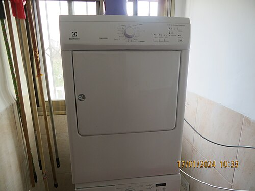
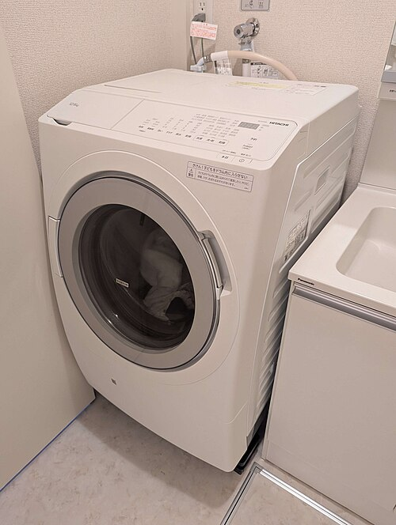

# 의류건조기 추천 히트펌프 — 2026 실사용자 비교, 전기세·건조시간·소음까지 총정리

베란다에 빨래를 너는 시대는 끝났습니다. 미세먼지, 장마철 꿉꿉함, 좁은 베란다에 시달리다가 건조기를 들이고 나서 빨래라는 가사 노동에 대한 인식 자체가 바뀌었습니다. 그런데 막상 사려고 보면 히트펌프, 전열식, 콘덴서 타입, 배기 타입 같은 용어가 쏟아져서 뭘 골라야 할지 막막하죠. 저도 첫 건조기 살 때 일주일 내내 카페와 후기만 뒤졌던 기억이 납니다.

이 글은 제가 두 대(LG 트롬, 위니아)를 직접 굴려보고, 부모님 댁 삼성 그랑데 AI까지 옆에서 지켜본 결과를 토대로 정리한 의류건조기 추천 가이드입니다. 2026년 5월 기준 쿠팡 최저가로 가격을 적었고, 히트펌프 한정으로 비교했습니다. 전열식은 솔직히 지금 시점에 추천드리기 어려워서 빠졌습니다.

## 히트펌프 vs 전열식 — 글 첫머리에 결론부터

먼저 가장 많이 헷갈려하시는 부분부터 정리하고 넘어가겠습니다. 결론부터 말씀드리면 **2026년에 새로 사신다면 무조건 히트펌프**입니다. 전열식은 이제 다나와에 신모델이 거의 안 올라옵니다.

### 비교표 — 한눈에 보는 차이

| 항목 | 히트펌프 | 전열식(콘덴서) |
|------|----------|----------------|
| 본체 가격(9kg) | 90~150만원대 | 50~80만원대 |
| 1회 전기세(표준코스) | 약 200~300원 | 약 600~900원 |
| 월 전기세(주 5회 사용) | 4,000~6,000원 | 12,000~18,000원 |
| 건조 시간(표준 4kg) | 2시간~2시간 30분 | 1시간~1시간 30분 |
| 옷감 손상 | 적음(저온 60℃대) | 많음(고온 80℃ 이상) |
| 소음 | 45~50dB | 55~60dB |
| 수명(평균) | 10년 이상 | 7~8년 |
| 설치 자유도 | 콘덴서 청소 필요 | 단순 |

차이가 보이시죠. 본체가 비싸도 5년만 굴리면 전기세 차이로 본전 뽑고, 옷감 데미지가 적어서 비싼 옷도 마음 놓고 돌릴 수 있습니다. 제가 첫 건조기로 전열식을 사서 2년 만에 후회한 이유가 바로 이거였습니다. 면 티셔츠 목 부분이 늘어나고, 검은색 옷이 6개월 만에 회색으로 바래더군요.

### 그럼 전열식은 왜 아직 팔리나

원룸용 미니 건조기(3kg 이하)나 가성비 보조 건조기 시장에서만 명맥을 유지합니다. 메인 건조기로 쓰실 거면 후보에서 빼셔도 됩니다. 친정에 있던 10년 된 LG 전열식 모델을 작년에 처분했는데, 그때 비교해보니 같은 빨래량에 전기세가 4배 차이 나더군요. 어머니께 죄송한 마음이 들 정도였습니다.

### 히트펌프 작동 원리 — 잠깐만 짚고 가시죠

원리를 알면 왜 전기세가 적게 나오는지 이해됩니다. 히트펌프는 에어컨을 거꾸로 쓰는 구조입니다. 냉매를 압축해서 만든 따뜻한 공기로 빨래를 말리고, 빨래에서 나온 습기는 차가운 콘덴서에 응축시켜 물로 뽑아냅니다. 한 번 만든 열을 계속 순환시키니까 전기를 적게 먹는 거죠. 전열식은 히터로 매번 새로 데우니 전기를 그만큼 더 먹고 옷도 상합니다.

## 의류건조기 추천 5종 — 실사용 비교

본격적으로 모델별로 들어가겠습니다. 9kg 이상 메인급으로 추렸고, 1인 가구용 미니 건조기는 다른 글에서 다루겠습니다.

### 1. LG 트롬 오브제컬렉션 RC91U (9kg) — 종합 1위

**2026년 5월 쿠팡 최저가: 약 138만원 (오브제 컬러 기준 +10만원)**

제가 지금 쓰고 있는 모델입니다. LG 트롬 라인은 의류건조기 추천 리스트에서 빠지는 적이 거의 없는데, 그 이유를 직접 써보고 알았습니다. 인버터 히트펌프가 정숙하고, 콘덴서 자동세척이 진짜로 작동합니다. 다른 브랜드는 자동세척이라고 적혀 있어도 6개월에 한 번은 직접 분해 청소를 해야 하는데, 이건 1년 가까이 분해 안 했는데도 막힘이 없습니다.

**장점**
- 듀얼 인버터 히트펌프 — 소음 47dB, 진동 거의 없음
- 콘덴서 자동세척 3중 시스템(실제 작동)
- 트루스팀 옵션 — 살균, 구김 제거에 효과 있음
- ThinQ 앱 연동 안정적

**단점**
- 가격대가 높음(오브제 컬러는 더 비쌈)
- 9kg 풀로 돌리면 2시간 30분 걸림(체감 약간 김)

### 2. 삼성 그랑데 AI DV90B 시리즈 (9kg) — AI 자동코스 강자

**2026년 5월 쿠팡 최저가: 약 129만원**

부모님 댁에 설치해 드려서 자주 쓰는 모델입니다. 삼성의 강점은 AI 코스인데, 진짜로 옷감과 양을 인식해서 시간을 조절합니다. 약하게 돌려도 충분한 게 아니라, 빨래 양이 적으면 알아서 시간을 줄여줘서 전기세가 LG보다 살짝 덜 나옵니다(체감 월 1,000원 차이).

**장점**
- AI 맞춤 건조 — 옷감/양 자동 인식
- 위생살균+ 코스 — 알러지 케어에 좋음
- 비스포크 컬러 매칭(세탁기와 톤 통일)
- 건조시간 LG보다 약간 빠름(2시간 10분)

**단점**
- 콘덴서 자동세척이 LG 대비 살짝 약함(연 1회 직접 청소 권장)
- 진동이 풀로드 시 LG보다 큼

### 3. 위니아 히트펌프 건조기 WCR9DE (9kg) — 가성비 추천

**2026년 5월 쿠팡 최저가: 약 79만원**

저희 집 보조용으로 들였던 모델입니다. LG/삼성 대비 30~50만원 저렴한데 핵심 성능(히트펌프 효율, 건조 품질)은 90% 따라옵니다. 부족한 건 부가기능(스팀, AI, 앱 연동)인데, "그냥 건조만 잘 되면 된다"는 분께는 이게 정답입니다.

**장점**
- 가격 — 메이저 브랜드 대비 30% 이상 저렴
- 히트펌프 자체 효율은 양호(에너지효율 1등급)
- 9kg 대용량인데 본체는 콤팩트한 편

**단점**
- 콘덴서 자동세척 없음(수동 청소 필수)
- 앱 연동 없음, 스팀 없음
- A/S 네트워크가 LG/삼성 대비 좁음

### 4. 캐리어 클라윈드 히트펌프 9kg — 복병 가성비

**2026년 5월 쿠팡 최저가: 약 69만원**

에어컨으로 유명한 캐리어가 만든 건조기입니다. 의류건조기 추천 리스트에 잘 안 올라오는데, 가격 대비 만족도가 좋아서 넣었습니다. 히트펌프는 캐리어가 본업이다 보니 효율 자체는 검증됐습니다. 다만 디자인이 약간 투박하고 도어 힌지가 LG/삼성만큼 부드럽지는 않습니다.

**장점**
- 가성비(70만원 미만 9kg 히트펌프)
- 히트펌프 효율 양호
- 단순한 조작 — 어르신 댁에 좋음

**단점**
- 디자인이 평범
- 부가기능 거의 없음
- 후기 풀이 LG/삼성/위니아 대비 적어서 사례 비교가 어려움

### 5. LG 트롬 미니 RH8WV (8kg) — 1.5인 가구·신혼용

**2026년 5월 쿠팡 최저가: 약 109만원**

9kg가 부담스럽고 8kg면 충분한 분께 추천합니다. 신혼이나 1.5인 가구(반려동물 포함)에 적당합니다. 본체 깊이가 660mm로 일반 9kg(680mm)보다 살짝 슬림해서 베란다 설치 자유도가 높습니다.

**장점**
- 슬림한 깊이 — 좁은 베란다 가능
- LG 트롬 라인 품질 그대로
- 8kg면 4인 가족 빨래 한 번 분량 충분

**단점**
- 9kg 대비 가격 차이가 크지 않음(약 30만원)
- 이불 한 채는 8kg에도 빠듯함

## 전기세 — 진짜로 얼마나 차이 나나

가장 많이 받는 질문입니다. 1년치 전기세를 직접 측정해봤습니다(스마트플러그로 누적 전력량 기록).

### 실측 데이터 — LG 트롬 RC91U 기준

- 표준코스 4kg 1회: 약 1.2kWh → 220원(누진 2단계 기준)
- 주 5회 × 4주 = 월 20회 → **월 4,400원**
- 연간: 약 53,000원

### 전열식과 비교

같은 사용량을 전열식으로 돌리면 월 약 14,000원, 연간 168,000원입니다. **연 11만원 차이**입니다. 5년이면 55만원, 10년이면 110만원이 전기세에서만 절약됩니다. 본체 가격 차이(약 50만원)를 5년이면 회수합니다.

### 누진 구간 주의

여름철에 에어컨까지 같이 쓰면 누진 3단계로 올라갈 수 있는데, 이때는 건조기 1회당 전기세가 350원까지 올라갑니다. 그래도 전열식보다는 절반 이하입니다. 7~8월에 한 달 전기료 폭탄이 무서우신 분은, 야간시간대(22시 이후) 예약건조 기능을 활용하세요. 시간대별 누진은 적용 안 되지만 심리적으로 덜 부담됩니다.

### 코스별 전기 사용량 — 이건 꼭 알아두세요

같은 9kg 모델이라도 코스에 따라 전기 사용량이 2배 가까이 차이 납니다. 표준코스가 가장 효율적이고, 살균코스(트루스팀, 위생살균+)는 약 1.5배, 침구류 코스는 약 2배 먹습니다. 침구는 자주 쓰는 게 아니니 괜찮은데, 매번 살균코스로만 돌리면 전기세가 두 배로 뜁니다. 일반 빨래는 표준, 아기 옷이나 행주만 살균코스로 분리하시는 게 합리적입니다.

## 설치 주의사항 — 콘덴서 vs 배기, 그리고 배수

### 콘덴서 타입(자체 응축) — 99%의 히트펌프 모델

위에 추천드린 5종 모두 콘덴서 타입입니다. 별도 배기구가 필요 없어서 베란다든 다용도실이든 어디든 설치 가능합니다. 다만 두 가지를 챙기세요.

1. **배수 처리** — 응축수가 나오기 때문에 본체 내부 물통에 모이거나, 호스로 배수구에 직결해야 합니다. 호스 직결을 추천합니다(물통 비우는 거 깜빡하면 건조 중단됩니다).
2. **콘덴서 청소** — 자동세척 모델이어도 6개월~1년에 한 번은 필터 분해해서 먼지 털어내세요. 안 하면 효율이 30%까지 떨어집니다.

### 배기 타입 — 거의 단종

벽에 구멍 뚫어서 배기관 빼는 방식인데, 신축 아파트에는 거의 없습니다. 신경 안 쓰셔도 됩니다.

### 세탁기 위 직렬 설치(세건세트) 시 체크

- 받침대(1단 키트) 필수 — LG/삼성 정품 약 8~12만원
- 세탁기 진동이 건조기로 전달될 수 있으니 세탁기 수평 먼저 잡으세요
- 키 작은 분은 도어 위치가 높아져서 빨래 꺼내기 불편할 수 있음

## 세탁기 연동(세건 세트) 구매 팁

### 같은 브랜드로 맞추시는 게 정답

LG 세탁기 + LG 건조기, 삼성 세탁기 + 삼성 건조기로 가셔야 합니다. 이유는 세 가지입니다.

1. **디자인 톤 통일** — 색상, 도어 모양이 맞음
2. **앱 연동** — ThinQ나 SmartThings에서 세탁 끝나면 자동으로 건조기 코스 추천
3. **A/S 일괄** — 한 번 부르면 두 대 같이 봐줌(출장비 절약)

### 사이즈 매칭 주의

세탁기 21kg + 건조기 9kg 같은 조합은 세탁기 한 번 돌리면 건조기 두 번 돌려야 합니다. 비효율적이에요. **세탁기 용량 = 건조기 용량 × 2 이하**로 맞추세요. 예: 세탁기 19kg에는 건조기 10kg 매칭.

### 직렬 vs 병렬 설치

베란다 폭이 1.6m 이상이면 병렬(나란히)이 편합니다. 좁으면 직렬(위아래)인데, 받침대 비용이 추가되고 진동 이슈가 생길 수 있습니다. 저희 집은 베란다 폭 1.4m라 직렬로 갔는데, 키 161cm인 와이프가 도어 위쪽까지 손이 안 닿아서 빨래 꺼낼 때마다 까치발을 듭니다. 키가 작은 분이 주로 쓸 집이면 무리해서라도 병렬로 가시는 걸 추천드립니다.

### 의류건조기 추천 모델 선택 시 확인할 5가지

쇼핑 페이지에서 잘 안 보여주지만 중요한 항목입니다.

1. **에너지효율 등급** — 1등급 필수. 2~3등급은 연 전기세 2~3만원 차이
2. **소음(dB) 스펙** — 50dB 이하 권장. 거실/베란다 인접 시 47dB 이하
3. **본체 깊이** — 660mm/680mm/720mm 차이 크니 베란다 실측 후 결정
4. **도어 개폐 방향** — 좌개폐/우개폐 변경 가능 모델 vs 고정 모델
5. **AS 보증 기간** — 컴프레서 5년/10년 차이는 수리비 30만원 차이

## 자주 묻는 질문 (FAQ)

### Q1. 의류건조기 추천 모델 중에서 무조건 1등을 꼽으면요?
종합적으로는 **LG 트롬 RC91U**입니다. 가격이 부담되시면 위니아 WCR9DE가 가성비 1위입니다. 부모님 댁용이나 자동코스를 중시하시면 삼성 그랑데 AI를 추천드립니다.

### Q2. 9kg면 4인 가족 충분한가요?
네, 충분합니다. 4인 가족 하루치 빨래(이불 제외)가 보통 3~4kg입니다. 9kg는 침구류 한 채까지 한 번에 돌릴 수 있습니다. 6kg는 4인 가족에는 좀 빠듯합니다.

### Q3. 건조기 돌리면 옷이 줄어들지 않나요?
히트펌프는 60℃대 저온이라 일반 옷감(면, 폴리에스터, 혼방)은 문제없습니다. 다만 캐시미어, 실크, 울 100% 같은 건 표준코스 금지입니다. "울/섬세 코스"로 돌리거나 자연 건조하세요.

### Q4. 콘덴서 청소 안 하면 어떻게 되나요?
효율이 떨어져서 건조 시간이 30~50% 길어지고, 전기세도 그만큼 더 나옵니다. 심하면 빨래에서 쉰내가 납니다. 자동세척 모델이어도 1년에 한 번은 직접 청소를 권장합니다.

### Q5. 베란다에 두면 겨울에 얼지 않나요?
히트펌프 자체는 영하 5℃까지 정상 작동합니다. 다만 응축수 배수 호스가 얼 수 있으니, 영하 10℃ 이하 지역은 호스에 보온재를 감아두세요.

### Q6. 미니 건조기(3kg)랑 9kg 둘 다 사는 게 좋다는데 진짜인가요?
가성비로는 9kg 한 대가 낫습니다. 다만 속옷·양말 같은 소량 빨래를 자주 돌리시는 분이라면 미니 건조기를 보조로 두면 전기세 절약됩니다(9kg에 양말 5켤레만 돌리면 비효율).

### Q7. 이사 갈 때 건조기 옮기기 까다롭지 않나요?
설치기사 부르시면 됩니다. 이전 설치비 5~7만원입니다. 자가 이전은 비추천입니다(콘덴서 액 누출 위험).

### Q8. AS 기간은 얼마나 되나요?
LG/삼성은 본체 1년, 핵심부품(컴프레서) 10년입니다. 위니아/캐리어는 본체 1년, 컴프레서 5년입니다. 컴프레서가 가장 비싼 부품(수리비 30~50만원)이라 AS 기간 길수록 유리합니다.

## 마무리 — 이 글 한 줄 요약

**예산 130만원 이상이면 LG 트롬 RC91U, 80만원 선이면 위니아 WCR9DE, 부모님 댁이면 삼성 그랑데 AI 추천드립니다.** 전열식은 후보에서 빼시고, 9kg 이상으로 가시고, 콘덴서 청소만 잊지 않으시면 됩니다.

가전 추천 시리즈 다른 글도 같이 보시면 좋습니다. 좁은 집 청소 솔루션은 [무선청소기 추천](/2026-05-07-무선청소기-추천-1인가구/) 글에서, 밥 짓기는 [전기밥솥 추천](/2026-05-07-전기밥솥-추천-IH-6인용/) 글에서 다뤘습니다.

읽어주셔서 감사합니다. 빨래 노동에서 해방되시길 바랍니다.
