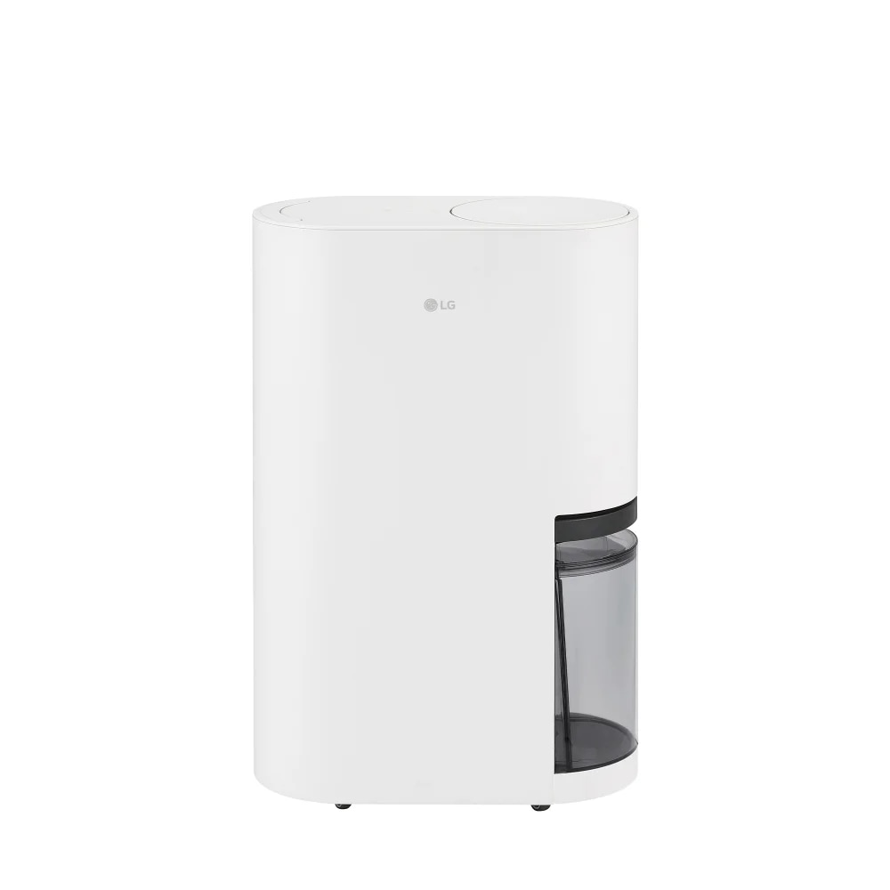

# 2026 제습기 추천 — 소형·중형 비교, 3년 실비용까지 계산해봤습니다

장마 직전이 되면 제습기 검색량이 폭발하더라고요. 그런데 블로그를 아무리 뒤져봐도 "구매가만" 비교한 글이 대부분이에요. 솔직히 말하면, 제습기는 24시간 트는 가전이라 **전기요금까지 합쳐야 진짜 비교**가 되거든요.

이번 글은 그래서 좀 다르게 썼어요. **구매가 + 3년 전기요금 = 총 소유비용**을 다 계산해서, 평수별로 진짜 가성비가 뭔지 정리했습니다. 직접 위닉스 뽀송 12L를 2년째 쓰고 있고, 작년에 부모님 댁에 LG 휘센 인버터를 들였던 경험까지 녹였어요.

## 5초 요약 — 평수별 제습기 추천

복잡한 거 다 빼고 평수별로 정리하면 이렇게 나옵니다.

| 평수 | 추천 모델 | 가격 | 에너지등급 | 3년 실비용 |
|------|-----------|------|------------|------------|
| 10평 이하 (원룸) | **위닉스 뽀송 12L** | 299,000원 | 3등급 | 약 587,000원 |
| 15~20평 (아파트) | **LG 휘센 인버터 13L** | 449,000원 | 1등급 | 약 665,000원 |
| 15~20평 신제품 | **위닉스 뽀송 인버터 16L** | 약 499,000원 | 1등급 | 약 715,000원 |
| 25~30평 (대형 평수) | **캐리어 20L** | 290,000원 | 1등급 | 약 506,000원 |

이 표만 보고 가셔도 됩니다. 더 자세한 근거가 궁금하시면 아래로 내려가시면 돼요.

## 제습기 추천 전, 용량부터 정확히 골라야 합니다

용량을 잘못 고르면 아무리 비싼 제습기도 무용지물이에요. 너무 작으면 24시간 돌려도 안 마르고, 너무 크면 전기요금만 더 나오죠.

### 평수별 용량 공식

이게 진짜 중요한 포인트인데요, 의외로 매장에서도 잘 안 짚어주는 부분이에요.

- **10평 이하** → 10~12L
- **15~20평** → 13~16L
- **25~30평** → 18~20L
- **30평 초과** → 20L 이상

### 환기가 안 되는 집은 한 단계 위로

저희 집이 정북향에 환기가 거의 안 되는 구조인데, 처음에 12L 사서 후회했거든요. 같은 평수라도 **환기 안 되는 집, 1층, 반지하, 북향**은 한 단계 위 용량을 추천합니다. 안 그러면 제습기가 24시간 풀가동돼서 전기요금이 1.5배로 뜁니다.

## 소형 제습기 추천 (10평 이하 원룸)

원룸이나 작은 방용 소형 제습기는 사실 선택지가 많지 않아요. 베스트셀러 한두 개로 정리됩니다.

### 위닉스 뽀송 12L — 원룸 표준 모델

- **가격**: 299,000원
- **에너지등급**: 3등급
- **물통**: 3.0L
- **연속배수 지원**

직접 2년 써본 입장에서 말하자면, 원룸 사신다면 이거 하나로 끝납니다. 작년 6월 장마 첫날, 거실에 두고 작동시켰는데 다음 날 새벽 2시쯤 물통 가득 찼다는 알림이 깜빡거리더라고요. 8시간 정도 돌리면 3L 물통이 거의 다 차는 셈이에요. 그 뒤로는 베란다 배수구에 호스 직결로 바꿨고, 그게 정신건강에 훨씬 좋습니다.

인버터가 아니라 정속형이라 살짝 시끄럽긴 한데, 거실 한쪽에 두고 자도 잠 깰 정도는 아니에요. 33dB 정도 됩니다.

다만 **에너지 3등급**이라는 게 함정이에요. 24시간 트는 장마철엔 월 9,000원 정도 나옵니다. 정속형이라 켜졌다 꺼졌다를 반복하지 않고 풀가동하기 때문이죠.

소형 제습기 시장에서 가성비로는 여전히 1위지만, 전기요금까지 따지면 다음 섹션의 중형 인버터 모델이 의외로 경쟁력이 있어요.

## 중형 제습기 추천 (15~20평 아파트)

여기서부터가 진짜 비교 포인트입니다. 중형 제습기는 인버터냐 정속형이냐로 완전히 갈리거든요.

### LG 휘센 인버터 13L — 듀얼 인버터의 정석

- **가격**: 440,000~449,000원
- **에너지등급**: 1등급
- **듀얼 인버터 컴프레서**
- **월 전기요금**: 5,000~7,000원

부모님 댁에 작년에 들인 모델이에요. 솔직히 처음엔 가격 보고 "굳이 14만 원이나 더 줘야 하나" 싶었는데, 한 달 써보니 답이 나오더라구요. **위닉스 정속형 대비 월 3,000~4,000원이 절약**됩니다. 1년이면 4만 원, 3년이면 12만 원 차이죠.

설치하고 처음 작동시킨 게 작년 7월 초 저녁이었는데, 어머니가 "어머, 이거 켠 거 맞니? 소리가 안 나네" 하시더라고요. 그동안 옛날 정속형 제습기를 쓰셔서 시끄러운 게 당연한 줄 아셨거든요. 거실에서 TV 보시면서도 전혀 거슬리지 않는다고 만족하세요. 지금은 안방으로 옮겨서 주무실 때도 켜놓고 주무실 정도예요.

인버터는 설정 습도에 도달하면 살살 돌고, 모자라면 풀가동하는 방식이라 소음도 훨씬 덜합니다.

### 위닉스 뽀송 인버터 16L — 2026년 신제품

올해 새로 나온 모델이에요. 위닉스가 드디어 인버터 라인업을 제대로 들고 나왔습니다.

- **에너지등급**: 1등급
- **소음**: 38dB (저소음)
- **R290 친환경 냉매**
- **물통**: 4.5L
- **360도 캐스터휠**

LG 대비 차별점은 **물통 용량(4.5L)과 캐스터휠**이에요. 매일 물통 비우기 귀찮은 분, 또는 방마다 옮겨가며 쓰실 분에게 맞습니다. 가격은 LG보다 약간 비싸요.

### 위닉스 DN2H160-IWK 16L — 효율 끝판왕

같은 위닉스 16L 라인 중에서도 **제습효율 2.83**으로 가장 좋습니다. 소비전력 270W, 6.0L 대용량 물통. 효율 수치만 보면 가장 뛰어나지만, 가격대가 높고 디자인이 호불호가 갈리죠.

## 가정용 제습기 추천 (25~30평 대형 평수)

대형 평수는 18~20L급이 답이에요. 작은 거 두 대 사느니 큰 거 한 대가 효율이 좋습니다.

### 캐리어 20L — 의외의 가성비 다크호스

- **가격**: 약 290,000원
- **에너지등급**: 1등급

이게 진짜 다크호스예요. 20L급이 30만 원 미만에, 1등급이라는 조합은 흔치 않거든요. 캐리어 브랜드 인지도가 LG보다 낮아서 저평가되는데, 에어컨 만들던 회사라 컴프레서 기술은 검증돼 있죠.

### LG 오브제컬렉션 18L — 디자인 가전파라면

- **렌탈**: 월 19,900원~ (60개월)
- 인버터 탑재

일시불보다 렌탈로 많이 나가는 모델이에요. 인테리어 신경 쓰시는 분이라면 후보. 다만 렌탈 60개월 총비용은 약 119만 원이라, 일시불 캐리어 대비 4배입니다. 디자인 프리미엄을 인정하느냐의 문제예요.

## 인버터 vs 정속형 — 3년 실비용 차이가 진짜입니다

여기가 이 글의 핵심이에요. 가전 매장에서도 잘 짚어주지 않는 부분이거든요.

### 월 전기요금 비교

| 구분 | 정속형 (3등급) | 인버터 (1등급) | 차이 |
|------|----------------|----------------|------|
| 월 전기요금 (장마철 24시간) | 8,000~10,000원 | 5,000~7,000원 | 약 3,000~4,000원 |
| 연 전기요금 (4개월 가동 기준) | 32,000~40,000원 | 20,000~28,000원 | 약 12,000원 |
| **3년 누적 전기요금** | **약 96,000~120,000원** | **약 60,000~84,000원** | **약 36,000원** |

### 총 소유비용 (구매가 + 3년 전기요금)

| 모델 | 구매가 | 3년 전기요금 | **총 소유비용** |
|------|--------|--------------|------------------|
| 위닉스 뽀송 12L (정속형) | 299,000원 | 약 288,000원 | **587,000원** |
| LG 휘센 인버터 13L | 449,000원 | 약 216,000원 | **665,000원** |
| 위닉스 뽀송 인버터 16L | 약 499,000원 | 약 216,000원 | **715,000원** |
| 캐리어 20L (1등급) | 290,000원 | 약 216,000원 | **506,000원** |

※ 1일 8시간, 연 4개월(장마+여름) 가동 기준 추정. 실제 사용 환경에 따라 차이 있음.

이 표를 보고 뭔가 이상한 점 느끼셨나요? **캐리어 20L가 총 소유비용으로 가장 저렴**해요. 큰 용량인데도 1등급이라 전기요금이 안 나오고, 구매가도 30만 원 미만이라 그렇습니다.

물론 원룸에 20L를 들이는 건 오버스펙이지만, **15~20평 이상이라면 캐리어 20L가 의외의 정답**일 수 있죠.

## 가성비 제습기 추천 — 상황별 베스트

위 데이터를 종합해서 상황별로 정리하면 이렇습니다.

### 예산 30만 원 이하

- **원룸**: 위닉스 뽀송 12L (299,000원)
- **15평 이상**: 캐리어 20L (약 290,000원) — 강력 추천

### 예산 45만 원, 인버터 절감 + 정숙성 우선

- **15~20평 아파트**: LG 휘센 인버터 13L

### 예산 50만 원 이상, 신제품 선호

- 위닉스 뽀송 인버터 16L (2026 신제품, R290 냉매)

### 디자인 가전 + 렌탈 선호

- LG 오브제컬렉션 18L (월 19,900원~)

여름철 가전 라인업을 같이 보고 싶으시다면 [INTERNAL_LINK:선풍기 추천] 글과 [INTERNAL_LINK:에어컨 추천] 글도 같이 보시면 좋아요. 제습기-에어컨-선풍기 조합이 장마철 전기요금을 가장 많이 절약하거든요.

## 제습기 살 때 꼭 확인할 5가지 체크리스트

매장에서 직원 말만 듣고 사면 후회해요. 직접 측정해보면서 정리한 체크리스트입니다.

1. **에너지등급 1등급 vs 3등급** — 24시간 가전이라 무조건 1등급 우선
2. **인버터 여부** — 소음·전기요금 양쪽에서 차이가 큼
3. **물통 용량 4L 이상** — 그 이하면 매일 비워야 함
4. **연속배수 지원** — 호스로 베란다 배수구 직결 가능
5. **소음 35dB 이하** — 거실에서 TV 봐도 안 거슬림

## 제습기 추천 자주 묻는 질문 (FAQ)

### Q1. 제습기랑 에어컨 제습 모드, 뭐가 더 효율적인가요?

전기요금만 보면 에어컨 제습 모드가 약간 비싸요. 에어컨은 컴프레서가 큰 데다 실외기까지 돌아가서, 전력 소비가 제습기 대비 1.5~2배거든요. 다만 면적이 30평 이상이면 에어컨 제습이 빠릅니다. **20평 이하라면 무조건 제습기가 답**이에요.

### Q2. 제습기 24시간 켜놔도 되나요?

네, 됩니다. 오히려 그게 정상 사용법이에요. 다만 **연속배수 호스를 베란다 배수구에 연결**해두셔야 물통 비우기 스트레스가 없죠. 인버터 모델은 설정 습도(보통 50~60%)에 도달하면 자동으로 약하게 돌기 때문에 24시간 켜놔도 전기요금 폭탄 안 맞습니다.

### Q3. 위닉스랑 LG 중에 뭐 사야 하나요?

가격 우선이면 위닉스, 정숙성·인버터 기술 우선이면 LG예요. 솔직히 말하면 위닉스 정속형보다 **LG 인버터가 3년 총비용이 더 저렴**합니다(전기요금 절감 때문). 단, 초기 비용 부담이 크니 예산 보고 고르시면 돼요. 16L 인버터급은 위닉스 신제품도 LG에 견줄 만합니다.

## 결론 — 평수 확인하고 인버터 여부만 보면 됩니다

제습기 고를 때 복잡하게 생각할 거 없어요. 두 가지만 확인하세요.

1. **내 집 평수에 맞는 용량** (10평=12L, 15~20평=13~16L, 25~30평=20L)
2. **24시간 트는 가전이니 인버터+1등급 우선** (3년 누적하면 본전 뽑음)

원룸이면 위닉스 뽀송 12L, 아파트면 LG 휘센 인버터 13L 또는 캐리어 20L. 이 셋 중 하나면 후회 안 하실 거예요. 특히 **캐리어 20L**는 정말 숨은 가성비 모델이니, 평수만 맞으면 진지하게 고려해보시길 추천합니다.

장마는 매년 오잖아요. 5만 원 더 아끼려고 정속형 사느니, 인버터 사서 3년 동안 12만 원 절약하는 게 합리적이죠. 그게 진짜 가성비입니다.
