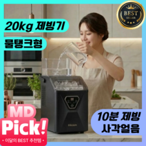
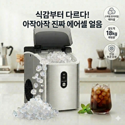
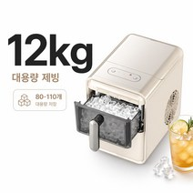
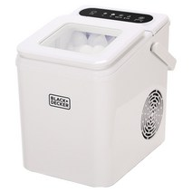
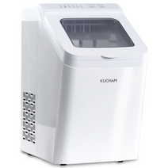

# 가정용 아이스메이커 추천 2026 — 큐브형부터 너겟형까지 5가지 비교

작년 여름 얘기를 먼저 해드릴게요. 손님이 갑자기 오셔서 냉커피를 한꺼번에 여섯 잔 만들어야 했는데, 냉장고 얼음칸을 다 털어도 두 잔분이 간신히 나왔어요. 결국 편의점에서 봉지 얼음을 사 왔고, 그날 밤 바로 아이스메이커를 검색하기 시작했습니다.

그런데 막상 검색해보면 **제빙기 종류가 생각보다 많고**, 큐브형인지 너겟형인지, 용량이 얼마인지, 물탱크 급수인지 자동 급수인지에 따라 용도가 완전히 달라져요. 모델만 나열한 글이 많아서 실제로 뭘 사야 하는지 감이 안 오더라고요.

이번 글에서는 **용도별로 맞는 제빙기가 뭔지**, 큐브형과 너겟형의 실제 차이, 용량 계산법까지 정리했습니다. 5가지 제품을 직접 비교해서 어느 상황에 어느 걸 사야 하는지 명확하게 알려드릴게요.

## 5초 요약 — 용도별 아이스메이커 추천

복잡한 거 다 빼고 용도별로 정리하면 이렇게 나옵니다.

| 용도 | 추천 모델 | 가격 |
|------|-----------|------|
| 사무실·소규모 음료 (가성비 큐브) | [큐빙 사각얼음 제빙기](https://link.coupang.com/a/dQ9jYxN5fU) | 187,900원 (정가 197,900원) |
| 씹어먹는 얼음·카페 스타일 | [에어셀 아이스 2026 너겟형](https://link.coupang.com/a/dQ9kIP7Syi) | 369,000원 (정가 389,000원) |
| 소형 가성비 (1~2인 가구) | [가정용 미니 제빙기 9구 12kg](https://link.coupang.com/a/dQ9lsVXj7Q) | 173,990원 (정가 699,990원) |
| 캠핑·차량 겸용 빠른 제빙 | [블랙앤데커 BXEM1260-A](https://link.coupang.com/a/dQ9mc5K9wi) | 129,000원 |
| 대가족·캠핑·업소 겸용 | [쿠참 올스텐 자동세척 17kg](https://link.coupang.com/a/dQ9mXBQiT6) | 299,000원 (정가 399,000원) |

이 표만 보고 가셔도 됩니다. 더 자세한 근거가 궁금하시면 아래로 내려가시면 돼요.

## 큐브형 vs 너겟형, 뭐가 다를까요

아이스메이커를 처음 사는 분들이 가장 헷갈리는 부분이에요. 두 종류는 **만들어내는 얼음 모양과 쓰임새가 완전히 다릅니다.**

### 큐브형 얼음

냉장고에서 나오는 그 얼음이에요. 딱딱하고 투명하거나 반투명한 사각 얼음.

- 음료에 넣으면 **천천히 녹아서 희석이 덜 됩니다**
- 위스키·맥주·탄산음료처럼 희석을 원하지 않는 음료에 적합
- 제빙 속도가 상대적으로 빠르고 전력 소비가 낮음
- 일반 가정용, 사무실, 손님 접대용에 어울림

### 너겟형 얼음 (Nugget Ice)

최근 카페에서 자주 보이는 작고 부드러운 얼음이에요. 쉽게 씹히는 게 특징.

- **씹어먹는 맛이 있어서** 아메리카노, 스무디, 버블티에 잘 맞음
- 온도를 빠르게 낮추는 효과가 큼 (표면적이 넓음)
- 제빙 과정이 더 복잡해서 가격대가 높음
- 카페 창업, 홈카페 트렌드와 함께 수요가 급증 중

**어떤 걸 골라야 하나요?** 그냥 음료에 얼음 넣는 용도라면 큐브형으로 충분합니다. 카페처럼 쓰거나 씹는 얼음을 좋아하신다면 너겟형이 맞아요.

## 아이스메이커 선택 가이드 — 구매 전 확인할 3가지

### 1. 일일 생산량: 몇 kg이 필요한가

| 사용 상황 | 필요 일일 생산량 |
|-----------|----------------|
| 1~2인 가구, 가끔 사용 | 8~12kg |
| 3~4인 가구, 매일 사용 | 12~15kg |
| 손님 접대 잦거나 홈카페 | 15~20kg 이상 |
| 소규모 카페·사무실 | 20kg 이상 |

가정에서는 **12~15kg** 정도면 충분합니다. 넘치게 많이 필요하진 않아요.

### 2. 급수 방식: 물탱크 vs 자동 급수

- **물탱크 방식**: 직접 물을 채워야 함. 이동이 자유롭고 설치가 간단. 캠핑에도 활용 가능.
- **자동 급수 방식**: 정수기나 수도에 연결해서 물이 자동 공급. 한 번 설치하면 편리하지만 위치가 고정됨.

이동하면서 쓸 계획이 있다면 물탱크 방식이 더 실용적입니다.

### 3. 소비전력과 전기요금

대부분의 가정용 아이스메이커는 **100~200W** 수준입니다. 하루 8시간 가동 기준으로 월 2~5만 원 정도의 전기요금이 추가될 수 있어요. 연속 가동하는 게 아니라 얼음이 필요할 때만 켜는 방식이라 실제 전기요금은 카탈로그 수치보다 적게 나옵니다.

## 제빙기 추천 1위 — 큐빙 사각얼음 제빙기 물탱크급수 가정용

- **가격**: 187,900원 (정가 197,900원, 47% 할인 표시 — 실구매가 기준)
- **얼음 형태**: 사각 큐브형
- **급수 방식**: 물탱크 (이동 자유)
- **주요 특징**: 가정용 설계, 물탱크 직접 급수, 사각얼음 대량 생산

큐빙 사각얼음 제빙기는 **물탱크 급수 방식**이라 정수기 연결 없이 어디서든 쓸 수 있는 게 핵심이에요. 주방에 놓고 쓸 수도 있고, 여름에 캠핑장에 들고 가서 캠핑카나 전기 연결 텐트에서도 사용 가능합니다.

사각얼음이라 희석 속도가 느려서 아이스 아메리카노, 아이스티, 칵테일 등 음료 본연의 맛을 유지하고 싶을 때 딱 맞아요. 장단점을 정리하면:

**장점**
- 물탱크 방식이라 설치 장소 제약 없음
- 사각얼음으로 희석이 느려 음료 맛 유지
- 가정 사용에 충분한 용량

**단점**
- 물탱크를 주기적으로 채워야 하는 번거로움
- 너겟형 대비 씹는 식감이 없음

[→ 쿠팡 최저가 보기](https://link.coupang.com/a/dQ9jYxN5fU)

## 제빙기 추천 2위 — 에어셀 아이스 2026 프리미엄 너겟형

- **가격**: 369,000원 (정가 389,000원, 26% 할인)
- **얼음 형태**: 너겟형 (에어셀 방식)
- **급수 방식**: 물탱크
- **주요 특징**: 2026 프리미엄 너겟형, 부드럽고 씹히는 얼음, 홈카페용

**너겟형 제빙기 중에서 2026년 신형 모델**입니다. 에어셀 방식으로 만들어지는 너겟 얼음은 카페에서 주는 그 얼음이에요. 아메리카노, 스무디, 버블티를 집에서 카페 수준으로 만들고 싶은 분들한테 딱입니다.

너겟형이라 얼음 표면적이 크고 음료 온도를 빠르게 낮춰줘요. 여름에 퇴근 후 아이스 아메리카노 한 잔 집에서 뽑아 마시는 루틴이 있다면 이 제품 하나면 완성입니다.

**장점**
- 카페용 너겟 얼음 구현
- 씹히는 식감이 좋아 만족도 높음
- 2026 신형 모델로 최신 설계

**단점**
- 큐브형 대비 가격대가 높음 (369,000원)
- 너겟 얼음은 상대적으로 녹는 속도가 빠름

[→ 쿠팡 최저가 보기](https://link.coupang.com/a/dQ9kIP7Syi)

## 제빙기 추천 3위 — 가정용 미니 제빙기 9구 12kg (가성비 최고)

- **가격**: 173,990원 (정가 699,990원, **75% 할인**)
- **얼음 형태**: 큐브형 (9구)
- **일일 생산량**: 약 12kg
- **주요 특징**: 소형·경량, 1~2인 가구 최적, 9구 동시 제빙

이 제품은 **가격 대비 성능 비율이 가장 좋습니다.** 정가 699,990원짜리가 75% 할인돼 173,990원이에요. 소형 미니 제빙기로 1~2인 가구나 소규모 사무실에서 쓰기에 충분한 일일 12kg 생산량을 갖추고 있습니다.

9구 동시 제빙 방식이라 한 사이클에 9개의 얼음을 동시에 만들어요. 빠른 제빙이 필요하고 공간도 많이 차지하지 않는 걸 원하는 분들한테 맞습니다.

**장점**
- 현재 가성비 최강 (75% 할인가 173,990원)
- 소형이라 주방 공간 절약
- 1~2인 가구에 충분한 용량

**단점**
- 대가족 사용 시 생산량 부족할 수 있음
- 정가 대비 할인가라 향후 가격 변동 가능성

[→ 쿠팡 최저가 보기](https://link.coupang.com/a/dQ9lsVXj7Q)

## 제빙기 추천 4위 — 블랙앤데커 급속 제빙기 BXEM1260-A

- **가격**: 129,000원
- **얼음 형태**: 큐브형
- **브랜드**: 블랙앤데커 (Black+Decker, 미국 브랜드)
- **주요 특징**: 급속 제빙, 글로벌 가전 브랜드, 컴팩트 디자인

**블랙앤데커**는 미국의 유명 가전·공구 브랜드예요. 가격이 129,000원으로 5개 중 가장 저렴하면서도 글로벌 브랜드의 품질 관리를 믿을 수 있다는 게 장점입니다.

급속 제빙 기능이 있어서 얼음이 빨리 필요한 상황에 유용해요. 컴팩트한 디자인이라 주방 카운터에 올려두거나 캠핑 트렁크에 넣어 가기에도 부담이 없습니다.

**장점**
- 5개 중 최저가 (129,000원)
- 글로벌 브랜드 품질 신뢰
- 급속 제빙으로 빠른 얼음 공급
- 컴팩트 디자인

**단점**
- 국내 브랜드 대비 AS 접근성 다소 낮을 수 있음
- 너겟형 미지원

[→ 쿠팡 최저가 보기](https://link.coupang.com/a/dQ9mc5K9wi)

## 제빙기 추천 5위 — 쿠참 올스텐 자동세척 가정용 17kg

- **가격**: 299,000원 (정가 399,000원, 25% 할인)
- **얼음 형태**: 큐브형
- **일일 생산량**: 17kg
- **소재**: 올스텐(전 스테인리스 내부)
- **주요 특징**: 자동세척 기능, 가정·캠핑·업소 겸용, 대용량

이 제품의 핵심은 두 가지입니다. **올스텐 내부 소재와 자동세척 기능.**

제빙기는 내부가 항상 젖어있어서 곰팡이가 생기기 쉬운 가전이에요. 쿠참 올스텐은 내부를 전부 스테인리스로 마감해서 위생 문제를 원천 차단했고, 자동세척 기능이 있어서 별도로 청소하는 번거로움도 크게 줄었습니다.

17kg 일일 생산량이라 3~4인 가구 대가족이나 손님이 자주 오는 집, 소규모 카페나 사무실에서도 쓸 수 있어요. 캠핑·업소 겸용이라 표현하는 만큼 내구성도 신경 쓴 모델입니다.

**장점**
- 올스텐 내부로 위생 탁월
- 자동세척 기능 (관리 편의)
- 17kg 대용량으로 가족·손님 접대 충분
- 캠핑·업소 겸용 내구성

**단점**
- 5개 중 두 번째로 높은 가격 (299,000원)
- 너겟형 미지원

[→ 쿠팡 최저가 보기](https://link.coupang.com/a/dQ9mXBQiT6)

## 아이스메이커 청소 방법 — 오래 쓰는 핵심

제빙기 수명을 좌우하는 건 **청소 주기**예요. 안 닦으면 내부에 물때와 곰팡이가 생겨서 얼음에서 이상한 냄새가 납니다.

기본 청소 루틴:

1. **주 1회**: 물탱크 비우고 깨끗한 물로 헹구기
2. **월 1회**: 식초물(물 1L + 식초 2큰술)로 내부 세척 후 깨끗한 물로 2~3회 헹굼
3. **계절 교체 시**: 완전 분해 청소 후 건조 상태로 보관

자동세척 기능이 있는 제품(쿠참 등)은 버튼 한 번으로 해결되니 훨씬 편합니다.

## FAQ

### Q. 아이스메이커 전기요금이 얼마나 나오나요?

가정용 아이스메이커는 보통 100~200W 소비전력입니다. 하루 4시간 가동 기준으로 한 달에 **2~4만 원** 정도 추가 예상하시면 됩니다. 필요할 때만 켜는 방식으로 쓰면 실제 전기요금은 카탈로그 수치보다 훨씬 적게 나와요.

### Q. 얼마나 자주 청소해야 하나요?

최소 **월 1회 내부 청소**를 권장합니다. 물탱크 방식은 고인 물이 세균 번식의 원인이 될 수 있어서, 자주 쓰지 않을 때는 물탱크를 비워두는 게 좋습니다. 자동세척 기능이 있는 모델은 청소 부담이 크게 줄어들어요.

### Q. 정수기에 연결할 수 있나요?

자동 급수 방식의 제빙기는 정수기 출수 라인에 연결 가능합니다. 이 글에서 소개한 제품들은 대부분 **물탱크 방식**이라 정수기 연결 없이 직접 물을 채워 사용해요. 정수기 연결이 필요하다면 자동 급수 모델을 따로 검색하시면 됩니다.

### Q. 캠핑장에서도 쓸 수 있나요?

물탱크 방식 제빙기는 전원(220V 콘센트 또는 캠핑 인버터)만 있으면 어디서든 사용 가능합니다. 블랙앤데커 BXEM1260-A나 큐빙 사각얼음 제빙기처럼 소형 컴팩트 모델은 캠핑 트렁크에 넣기에도 부담이 없어요. 쿠참 올스텐은 아예 캠핑 겸용으로 설계된 제품입니다.

## 결론 — 어떤 제빙기가 내 집에 맞을까

정리하면 이렇습니다.

- **예산이 가장 중요하다**: 블랙앤데커 BXEM1260-A **129,000원**
- **가성비 + 충분한 용량**: 가정용 미니 9구 12kg **173,990원** (75% 할인)
- **사무실·손님 접대 일반 큐브형**: 큐빙 사각얼음 제빙기 **187,900원**
- **위생·대용량·캠핑 겸용**: 쿠참 올스텐 자동세척 17kg **299,000원**
- **카페 스타일 너겟 얼음**: 에어셀 아이스 2026 너겟형 **369,000원**

작년 여름에 얼음 때문에 편의점 갔다 온 기억이 있는 분들, 올여름은 미리 준비해두시면 달라집니다. 4월~5월에 구입하면 더운 여름 시즌보다 가격이 안정적인 경우가 많아요.

이 글에서 소개한 5가지 제품은 모두 쿠팡 파트너스 링크로 연결됩니다. 구매하시면 저에게 소정의 수수료가 지급되지만, **제품 가격이나 구매 조건에는 전혀 영향이 없어요.** 합리적인 선택에 도움이 됐으면 좋겠습니다.

---
*이 포스팅은 쿠팡 파트너스 활동의 일환으로, 이에 따른 일정액의 수수료를 제공받습니다.*
