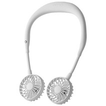
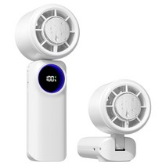
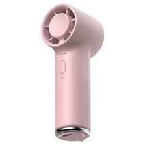
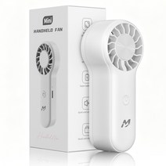

# 휴대용 미니 선풍기 추천 2026 — 목걸이·핸디·BLDC 5가지 완전 비교

지하철 환승역에서 땀을 뻘뻘 흘리다가 손선풍기 하나로 버티는 분들 많이 보셨을 거예요. 저도 작년 여름에 가방 속에 선풍기 하나 넣고 다니면서 출퇴근 체감 온도가 완전히 달라졌다는 걸 직접 느꼈습니다.

그런데 막상 검색해보면 **목걸이형인지 핸디형인지, BLDC 모터가 뭔지**, 풍속이 얼마나 되는지 제각각이라 고르기가 쉽지 않더라고요. 이번 글에서는 2026년 5월 기준 실제 구매 가능한 5가지 제품을 타입별로 분류해서 어느 상황에 뭘 사야 하는지 명확하게 정리해드리겠습니다.

## 5초 요약 — 용도별 미니 선풍기 추천

| 용도 | 추천 모델 | 가격 |
|------|-----------|------|
| 출퇴근 양손 자유 (넥밴드) | [블루아이디 무선 넥밴드 140g](https://link.coupang.com/a/dRc89qgH7c) | 29,800원 |
| 강풍·빠른 냉각 핸디형 | [PERFFIER 급속 냉각 손선풍기](https://link.coupang.com/a/dRc9UeF0fY) | 21,800원 |
| 책상·가방 초소형 BLDC | [무쿠 BLDC 초소형 3단](https://link.coupang.com/a/dRdaECOnZY) | 9,900원 |
| 가성비 입문형 초미니 | [맨큐 초미니 무선 손선풍기](https://link.coupang.com/a/dRdbpho3z2) | 9,900원 |
| 100단 정밀 온도조절 | [오아 아이스볼트맥스 100단](https://link.coupang.com/a/dRdcabK6i4) | 29,800원 |

이 표만 보고 가셔도 됩니다. 더 자세한 근거가 궁금하시면 아래로 내려가세요.

## 목걸이형 vs 핸디형, 실제로 어떻게 다를까요

휴대용 선풍기를 처음 사는 분들이 가장 헷갈리는 부분이에요. 두 타입은 **사용 상황이 완전히 다릅니다.**

### 목걸이(넥밴드)형 선풍기

목에 걸고 다니면서 양손이 자유로운 타입이에요.

- 지하철·버스·보행 중에도 **양손을 다른 일에 쓸 수 있습니다**
- 풍속이 핸디형보다 약하지만 장시간 연속 사용에 적합
- 무게 100~200g 수준으로 목에 걸어도 부담이 적음
- 출퇴근·등하교·쇼핑처럼 이동하면서 사용할 때 최적
- 대부분 USB-C 충전, 8~15시간 배터리

### 핸디형 선풍기

손에 쥐고 사용하는 일반적인 미니 선풍기 타입이에요.

- **풍속이 강해서 단시간 집중 냉각에 효과적입니다**
- 책상 위에 세워서 탁상형으로도 사용 가능한 제품이 많음
- 배터리 용량 대비 강한 바람이 나와서 야외 작업이나 스포츠에 유리
- 무게 80~150g 수준으로 가볍게 들고 다닐 수 있음

**어떤 걸 골라야 하나요?** 이동 중 양손이 필요하거나 장시간 사용한다면 목걸이형, 책상에서 집중적으로 쓰거나 강한 바람이 필요하다면 핸디형이 맞습니다.

## BLDC 모터가 일반 모터와 다른 이유

**BLDC(Brushless DC)** 모터는 쉽게 말해 브러시(전기 접점)가 없는 모터예요. 일반 선풍기 모터보다 다음 세 가지가 뛰어납니다.

- **소음이 훨씬 적습니다**: 브러시 마찰이 없어서 조용한 사무실에서도 쓸 수 있음
- **배터리 효율이 높습니다**: 같은 배터리로 더 오래 작동
- **수명이 길어집니다**: 마모 부품이 없어서 장기 사용에도 성능 저하 적음

단점은 제조 비용이 높아서 가격이 다소 올라간다는 것. 조용한 환경(사무실, 도서관)에서 쓴다면 BLDC가 확실히 가치 있습니다.

## 미니 선풍기 선택 가이드 — 구매 전 확인할 3가지

### 1. 주 사용 상황: 이동 중인가, 고정 사용인가

| 사용 상황 | 추천 타입 |
|-----------|----------|
| 출퇴근·등하교 이동 중 | 목걸이(넥밴드)형 |
| 책상·야외 고정 사용 | 핸디형 (탁상 겸용) |
| 도서관·사무실 조용한 공간 | BLDC 모터형 |
| 캠핑·스포츠 강한 바람 | 핸디형 고풍속 모델 |

### 2. 배터리 사용 시간

대부분의 가성비 미니 선풍기는 약풍 기준 **8~15시간** 배터리를 제공합니다. 강풍으로 사용하면 2~4시간으로 줄어드는 경우가 많아요.

- 하루 출퇴근(2~3시간) 사용이라면 5,000mAh 이상이면 충분
- 종일 사용이 필요하다면 7,000mAh 이상이나 보조 배터리 병용 고려
- 대부분 USB-C 충전 지원, 보조 배터리로 충전 가능

### 3. 무게와 크기

- **목걸이형**: 100~200g이면 목에 걸어도 피로감이 적음. 140g 이하 권장
- **핸디형**: 80~120g이면 장시간 들고 다니기 편함
- 여름 가방에 넣고 다닐 예정이라면 지름 10cm 이하 제품이 좋음

## 미니 선풍기 추천 1위 — 블루아이디 무선 넥밴드 휴대용 목 선풍기 140g

**가격: 29,800원** (정가 38,900원, 23% 할인)  
**쿠팡 바로가기**: [블루아이디 넥밴드 선풍기](https://link.coupang.com/a/dRc89qgH7c)

출퇴근 양손 자유가 필요한 분들께 1순위로 추천합니다. 무게가 140g으로 목에 걸어도 무겁지 않고, 좌우 각도 조절이 가능해서 바람이 얼굴로 정확히 오도록 세팅할 수 있어요.

**이런 분께 추천합니다**
- 지하철·버스 출퇴근 중 핸드폰 사용하면서 시원하게 있고 싶은 분
- 장시간 야외 행사·쇼핑몰에서 이동하면서 쓸 분
- 양손을 쓰는 일(요리·정리)을 하면서 시원하고 싶은 분

**스펙 핵심**
- 무게: 140g
- 충전: USB-C
- 가격: 29,800원 (정가 38,900원)

---

## 미니 선풍기 추천 2위 — PERFFIER 가성비 급속 냉각 휴대용 미니 무선 손선풍기

**가격: 21,800원** (정가 49,800원, 63% 할인)  
**쿠팡 바로가기**: [PERFFIER 급속 냉각 손선풍기](https://link.coupang.com/a/dRc9UeF0fY)

63% 할인으로 2만 원대에 급속 냉각 기능을 제공하는 핸디형 선풍기예요. 강한 바람과 빠른 냉각이 필요한 분, 가성비를 최우선으로 생각하는 분께 잘 맞습니다.

**이런 분께 추천합니다**
- 캠핑·야외 운동 등 강한 바람이 필요한 분
- 예산이 한정되어 있지만 성능은 포기하고 싶지 않은 분
- 처음 손선풍기를 사보는 분

**스펙 핵심**
- 타입: 핸디형 (급속 냉각)
- 충전: 무선 (USB-C 추정)
- 가격: 21,800원 (정가 49,800원, 63% 할인)

---

## 미니 선풍기 추천 3위 — 무쿠 BLDC 초소형 3단 미니 손 휴대용 선풍기 (파우더리)

**가격: 9,900원** (정가 33,000원, 70% 할인)  
**쿠팡 바로가기**: [무쿠 BLDC 초소형 3단 선풍기](https://link.coupang.com/a/dRdaECOnZY)

9,900원에 BLDC 모터를 쓴다는 게 놀라운 제품이에요. 조용한 사무실이나 도서관에서 써야 하는데 예산이 빠듯한 분께 적극 추천합니다. 파우더리 컬러로 디자인도 깔끔합니다.

**이런 분께 추천합니다**
- 도서관·독서실·사무실처럼 조용한 공간에서 쓸 분
- 소음이 예민해서 일반 선풍기가 거슬리는 분
- 1만 원 이하 가성비 BLDC 선풍기를 원하는 분

**스펙 핵심**
- 모터: BLDC (저소음)
- 단수: 3단 조절
- 가격: 9,900원 (정가 33,000원, 70% 할인)

---

## 미니 선풍기 추천 4위 — 맨큐 초미니 휴대용 선풍기 무선 손선풍기 대용량

**가격: 9,900원** (정가 29,900원, 83% 할인)  
**쿠팡 바로가기**: [맨큐 초미니 대용량 손선풍기](https://link.coupang.com/a/dRdbpho3z2)

83% 할인으로 1만 원 이하에 대용량 배터리를 갖춘 초미니 선풍기예요. 처음 미니 선풍기를 써보는 분, 자녀에게 저렴하게 하나 사줄 분께 잘 맞습니다.

**이런 분께 추천합니다**
- 미니 선풍기를 처음 사보는 입문자
- 학생·어린이용으로 저렴하게 장만하고 싶은 분
- 보조 선풍기로 하나 더 마련하고 싶은 분

**스펙 핵심**
- 타입: 초미니 핸디형
- 배터리: 대용량
- 가격: 9,900원 (정가 29,900원, 83% 할인)

---

## 미니 선풍기 추천 5위 — 오아 아이스볼트맥스 100단 미니 급속 냉각 핸디 휴대용

**가격: 29,800원** (정가 37,900원, 21% 할인)  
**쿠팡 바로가기**: [오아 아이스볼트맥스 100단](https://link.coupang.com/a/dRdcabK6i4)

100단계 풍속 조절이 가능한 프리미엄 핸디 선풍기예요. 자신에게 딱 맞는 바람 세기를 정밀하게 조절하고 싶은 분, 급속 냉각 기능과 세밀한 컨트롤 둘 다 원하는 분께 추천합니다.

**이런 분께 추천합니다**
- 바람 세기를 세밀하게 조절하고 싶은 분
- 급속 냉각 기능이 필요한 분
- 오아 브랜드의 완성도 높은 선풍기를 원하는 분

**스펙 핵심**
- 단수: 100단계 무단 조절
- 기능: 급속 냉각
- 가격: 29,800원 (정가 37,900원, 21% 할인)

---

## 미니 선풍기 FAQ

### Q. 미니 선풍기 배터리는 얼마나 가나요?

약풍 기준으로 대부분 8~15시간 사용이 가능합니다. 강풍으로 사용하면 2~4시간으로 크게 줄어들어요. 하루 출퇴근(2~3시간 사용) 기준이라면 대부분의 제품으로 충분하고, 하루 종일 야외 활동이라면 보조 배터리를 함께 챙기는 것이 좋습니다. USB-C 충전이 지원되는 제품은 보조 배터리로 충전하면서 동시에 사용할 수 있어서 편리합니다.

### Q. USB-C 충전 제품인지 어떻게 확인하나요?

최근 출시되는 미니 선풍기 대부분은 USB-C 충전 방식을 채택하고 있습니다. 구매 전 상품 상세 페이지에서 "USB-C", "C타입" 표시를 확인하세요. 본문에서 소개한 5개 제품은 모두 무선 충전 방식을 지원합니다. 마이크로 5핀 충전 방식은 구형 모델에 많으며, 편의성 면에서 USB-C가 더 낫습니다.

### Q. 비행기에 들고 탈 수 있나요?

내장 배터리 용량이 100Wh(약 27,000mAh) 이하면 기내 반입이 가능합니다. 일반 미니 선풍기의 배터리는 대부분 2,000~10,000mAh 수준이라 해당 기준을 충분히 만족합니다. 단, 항공사마다 정책이 다를 수 있으니 탑승 전 소속 항공사 기내 반입 규정을 한 번 확인하시는 걸 권장합니다.

### Q. 어린 아이도 안전하게 사용할 수 있나요?

미니 선풍기 날개는 회전 속도가 빠르기 때문에 **3세 미만 영유아에게는 사용하지 않도록 권장**합니다. KC 안전인증 마크가 있는 제품을 선택하면 기본적인 안전 기준을 통과한 제품입니다. 아이가 손가락을 넣지 않도록 주의하고, 사용 중에는 보호자가 함께 있는 것이 좋습니다. 날개 보호 케이지가 촘촘한 제품이 어린이 사용에 더 안전합니다.

## 결론 — 여름 출퇴근 더위, 타입 맞게 고르면 끝

미니 선풍기는 어떤 상황에서 쓰는지에 따라 타입 선택이 중요합니다.

- **이동하면서 양손 자유가 필요하다** → 블루아이디 넥밴드 (29,800원)
- **강한 바람으로 빠르게 식히고 싶다** → PERFFIER 핸디형 (21,800원, 63% 할인)
- **조용한 공간에서 소음 없이 쓰고 싶다** → 무쿠 BLDC (9,900원)
- **가성비 입문, 처음 써보는 분** → 맨큐 초미니 (9,900원, 83% 할인)
- **100단계 세밀 조절, 급속 냉각 둘 다** → 오아 아이스볼트맥스 (29,800원)

올여름엔 선풍기 하나로 체감 온도 차이를 직접 느껴보세요.

---
*이 포스팅은 쿠팡 파트너스 활동의 일환으로, 이에 따른 일정액의 수수료를 제공받습니다. 소비자에게 추가 비용이 발생하지 않습니다.*
